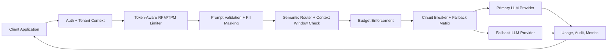

# llm_gateway

A production-style LLM gateway for enterprise GenAI applications: multi-tenant auth,
token-aware rate limiting, PII masking, model routing, fallback resilience, usage tracking,
and Prometheus-compatible metrics.



## What This Demonstrates

- OpenAI-compatible `POST /v1/chat/completions` API shape
- Multi-tenant API key authentication
- Token-per-minute and request-per-minute enforcement by tenant
- Prompt injection validation and PII masking before provider calls
- Semantic routing for simple, reasoning, coding, and long-context workloads
- Context-window protection with long-context fallback routing
- Circuit-breaker fallback when an upstream model fails
- Usage, cost, latency, audit, and fallback tracking
- Tenant daily/monthly monetary budgets with warning, hard-stop, override, and per-model caps
- Prometheus text metrics at `GET /metrics`
- One-command local environment with gateway, Redis, and Prometheus

The current providers are deterministic mocks, so the full API and test suite run without paid
LLM credentials. The provider boundary is intentionally small so OpenAI, Bedrock, Anthropic,
Gemini, or an internal inference endpoint can be added behind the same gateway contract.

## One-Command Local Spin-Up

```powershell
docker compose up --build
```

Then open:

- API docs: `http://127.0.0.1:8000/docs`
- Gateway health: `http://127.0.0.1:8000/health`
- Metrics: `http://127.0.0.1:8000/metrics`
- Prometheus: `http://127.0.0.1:9090`

## Local Python Setup

```powershell
python -m venv .venv
.\.venv\Scripts\Activate.ps1
pip install -e ".[dev]"
uvicorn app.main:app --reload
```

## Drop-In OpenAI SDK Demo

```python
from openai import OpenAI

client = OpenAI(
    base_url="http://localhost:8000/v1",
    api_key="demo-key-acme",
)

response = client.chat.completions.create(
    model="auto",
    messages=[
        {
            "role": "user",
            "content": "Summarize this renewal email: rahul@example.com needs a call.",
        }
    ],
)

print(response)
```

## PowerShell Request

```powershell
$body = @{
  model = "auto"
  task_type = "summarization"
  messages = @(
    @{
      role = "user"
      content = "Summarize this customer email: rahul@example.com needs a renewal call at 9876543210."
    }
  )
  metadata = @{
    user_id = "demo-user"
    trace_id = "trace-local"
  }
} | ConvertTo-Json -Depth 5

Invoke-RestMethod `
  -Uri "http://127.0.0.1:8000/v1/chat/completions" `
  -Method Post `
  -Headers @{ Authorization = "Bearer demo-key-acme" } `
  -ContentType "application/json" `
  -Body $body
```

## Demo API Keys

| Tenant | API key | Models | Limits |
| --- | --- | --- | --- |
| Acme Insurance | `demo-key-acme` | `mock-fast`, `mock-quality`, `mock-long-context` | 120 RPM / 50k TPM |
| Globex Finance | `demo-key-globex` | `mock-fast` | 30 RPM / 5k TPM |

Admin-only demo APIs use `Authorization: Bearer demo-key-admin`.

## Tenant Budgets

Configure a budget:

```powershell
$body = @{
  monthly_budget_usd = 100
  daily_budget_usd = 10
  warning_threshold = 0.8
  hard_stop_threshold = 1.0
  model_spending_limits_usd = @{
    "mock-fast" = 25
  }
} | ConvertTo-Json -Depth 5

Invoke-RestMethod `
  -Uri "http://127.0.0.1:8000/v1/admin/tenants/acme-insurance/budget" `
  -Method Put `
  -Headers @{ Authorization = "Bearer demo-key-admin" } `
  -ContentType "application/json" `
  -Body $body
```

Check consumption:

```powershell
Invoke-RestMethod `
  -Uri "http://127.0.0.1:8000/v1/tenant/budget" `
  -Headers @{ Authorization = "Bearer demo-key-acme" }
```

When a tenant crosses its hard threshold, chat requests return
`402 Payment Required` with `tenant_budget_exceeded`. If a model-specific cap is exhausted,
the fallback policy can route to the next allowed model.

## Resilience Demo

The mock provider can simulate an upstream outage so the fallback lane is easy to test:

```json
{
  "model": "mock-fast",
  "messages": [{"role": "user", "content": "Summarize this renewal note."}],
  "metadata": {
    "simulate_provider_error_for": ["mock-fast"]
  }
}
```

The gateway records the failure, trips the circuit after repeated errors, and serves the request
from the next healthy model allowed for the tenant.

## Tests

```powershell
python -m pytest
python -m ruff check .
```

## Roadmap

1. Replace in-memory circuit, limiter, and audit stores with Redis/Postgres adapters.
2. Persist tenant budgets, usage, and audit records in Postgres.
3. Add concrete OpenAI, Anthropic, Bedrock, Gemini, and Ollama providers.
4. Add structured-output validation with one self-correction retry.
5. Add semantic cache backed by Redis vector search or pgvector.
6. Add CI, deployment manifests, and a dashboard for latency and cost analytics.
